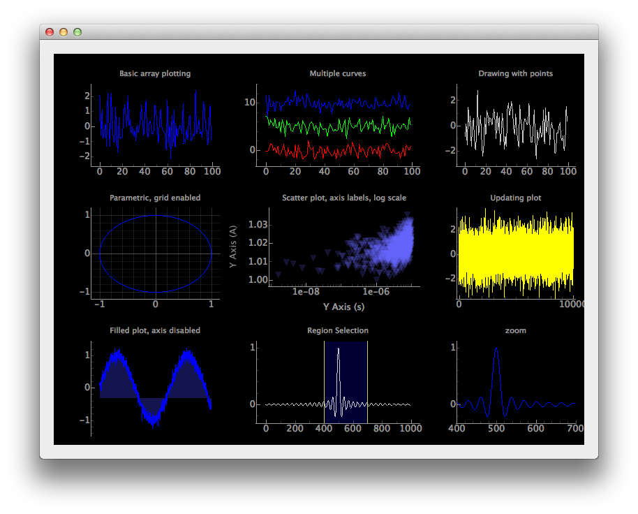

Examples for the `PySide` package


* `hello-world.jl` simple hello world with window, button, callback
  and message dialog

* `signal-slot.jl` check the signals and slots work. Shows the
  `qconnect` function to slightly simplify interface

* `events.jl` Simple example of defining a new class so that we can
  implement event handlers, as opposed to just signal handlers.

* `data-frame.jl` Shows `DataFrameModel` for a simple to create model
  for large data sets.

* `workspace.jl` simple workspace browser.

* `webbrowser.jl` simple use of QtWebKit to embed a web page. This one
  creates a primitive command line/output area. It illustrates a
  mechanism to write from `julia` to `JavaScript` and back.

* `menu.jl` shows how to work with menus

* `timer.jl` shows the basic use of `QTimer`, as an alternate to `Base.TimeoutAsyncWork`

## We have several example related to plotting

* `manipulate.jl` an implementation of `RStudio`'s `manipulate`
  interface for `R` (a stripped down version of Mathematica's). Uses
  `Winston` as written, but that isn't necessary.

* `svg.jl` simple use showing `Gadfly` graphic in svg widget

* `d3.jl` An attempt (failed) to plot using `d3.js` and
  `QWebView`. This fails as the evaluation of of `JavaScript` passed
  from `julia` to `Qt` is really sluggish.

* `simple-plotting.jl` shows how a QGraphicsScene can be used for
  simple plotting


## PyQtGraph

The PyQtGraph package (http://www.pyqtgraph.org/) provides a graphing
interface to Python through Qt written entirely in Python. This
package may be utilized by PySide, allowing relatively complex graphs
to be produced. The `PyQtGraph` module gives a light interface to the access. The following
examples illustrate a bit of what can be done.


* `pyqtgraph-scatterplot.jl` shows the scatterplot demo from
  `pyqtgraph`. 

* `pyqtgraph.jl` shows the plot demo from `pyqtgraph`.  The
  figure shows the result:


</img>


Making an embedded graph can be done as follows:

```
using PySide
using PySide.PyQtGraph

w = Widget()

## These three lines
win = GraphicsLayoutWidget(w)	## Grid of plot devices
p1 = addPlot(win, title="Basic array plotting") ## create a plot device
p1.plot(randn(100))		## make a line plot

## plotting a function
f(x) = sin(x^2)
x = linspace(0, 2pi, 1000)
p2 = addPlot(win, title="function")
p2.plot(x, map(f, x))

## simple scatter plot
p2.clear()
p2.addPoints(1:10, rand(10))

lyt = VBoxLayout(w)
setLayout(w, lyt)
addWidget(lyt, win)
set_size(w, 800, 600)
```
